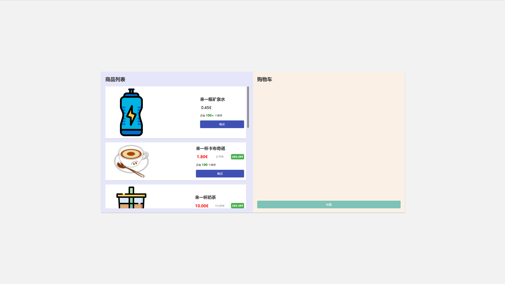
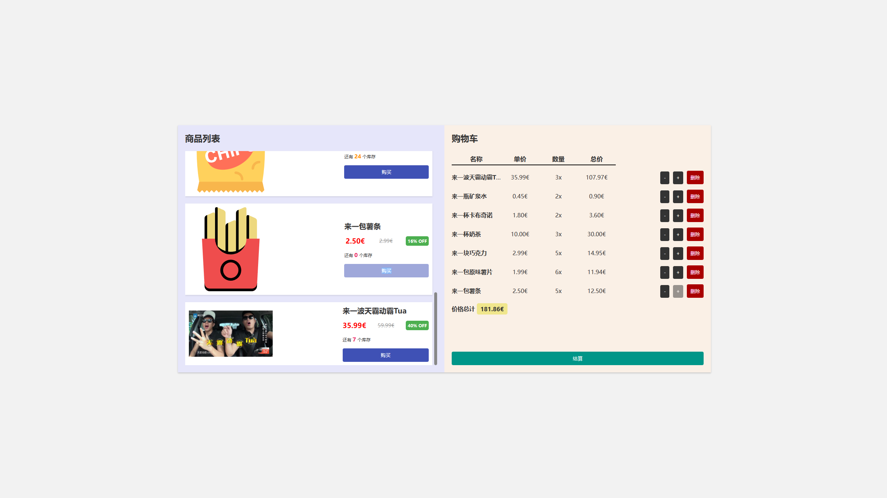
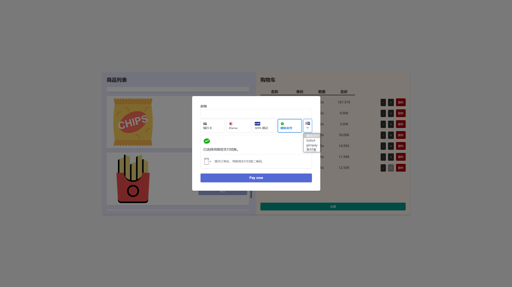
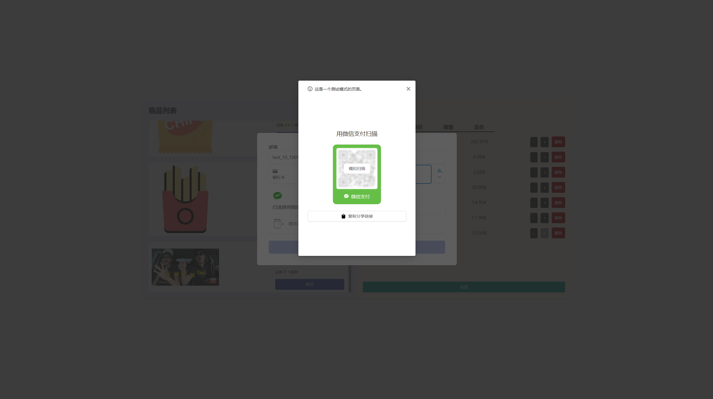
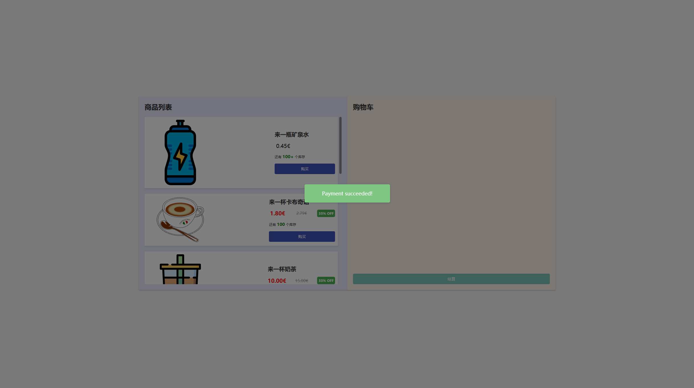

# EasyShopCart

  [Learn More](https://opensource.org/license/gpl-3-0/)

一个对接了Stripe集成支付系统的简易的购买单页网页  

如果您觉得本项目对您有帮助, 请给本项目一颗小小的 `Star` 呗QWQ

## 功能列表

- [x] 模拟了结算失败/成功的消息弹窗
- [x] ​实时模拟了库存数据的变化
- [x] ​右侧更方便的增加/减少对应物商品的数量
- [x] ​右侧更方便的直接删除商品
- [x] ​模拟了折扣价格
- [x] 统计商品总价
- [x] 商品缩略图展示
- [x] 对接Stripe集成支付系统
- [x] IDE友好
- [x] ES6标准
- [x] 傻瓜式使用方法
- [ ] 缓存购物车清单
- [ ] 后端仓库管理系统
- [ ] 后端订单管理系统
- [ ] 敬请期待...

## 使用方法

按需修改好配置文件之后即可立刻使用.

## 配置文件

`./assets/js/config.js`

```js
const config = {
    publicKey: 'YOUR_PUBLIC_KEY',          // Stripe提供的公钥
    orderCreateSite: '/stripe/create.php', // 支付处理后端接口
    returnUrl: 'http://test.com/stripe/'   // 支付成功/失败回调地址
}
```

`./secrets.php`

```php
<?php
// Stripe提供的私钥
$stripeSecretKey = 'YOUR_SECRET_API_KEY';
```

## 数据解析

`./assets/js/itemList.js` 为物品列表. 该文件仅用于测试使用, 你可以将 `itemLists` 替换为真实数据.

## Demo

首页展示


商品加入购物车展示


结算页面展示



微信支付模拟


支付成功弹窗

